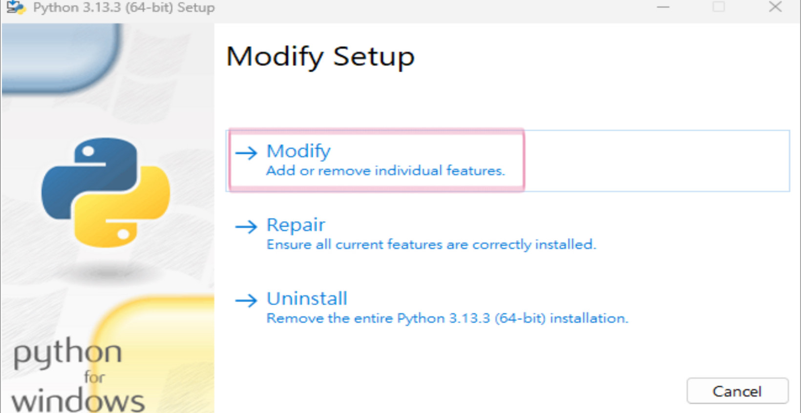
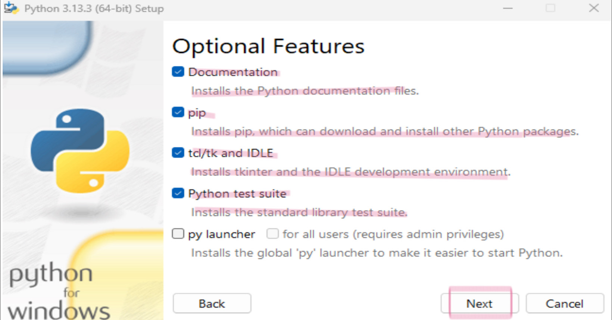
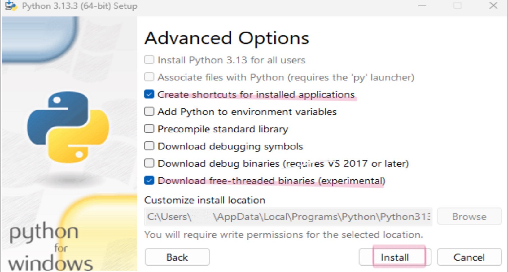
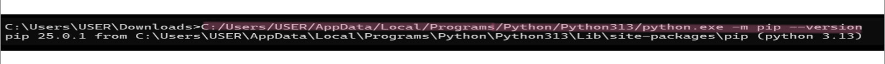
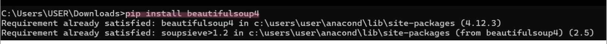
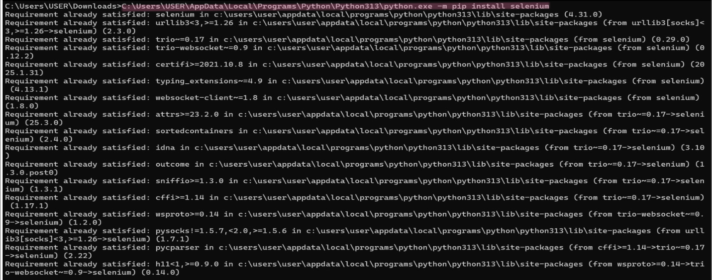

# _Python 爬蟲_

### 如何從亞洲大學資工系網站抓取教授個人資料

- [爬蟲教學](#爬蟲教學)
  - [網頁爬蟲介紹](#網頁爬蟲介紹)
  - [實例教學](#實例教學)
    - [第一步:下載](#第一步:下載)
      - [Python](#python)
      - [VS Code](#VSCode)
        - [VS Code安裝套件](#VSCode安裝套件)
      - [ChromeDriver](#ChromeDriver)
    - [第二步:安裝](#第二步:安裝)
      - [ pip](#pip)
      - [BeautifulSoup4](#BeautifulSoup4)
      - [Selenium](#Selenium)
    - [第三步:程式碼說明與配置](#第三步:程式碼說明與配置)
      - [引入模組](#引入模組)
      - [設定 ChromeDriver](#設定ChromeDriver)
      - [開啟目標網站與等待頁面載入](#開啟目標網站與等待頁面載入)
      - [模擬滾動頁面](#模擬滾動頁面)
      - [擷取 HTML 與關閉瀏覽器](#擷取HTML與關閉瀏覽器)
      - [儲存 HTML 以便除錯](#儲存HTML以便除錯)
      - [使用 BeautifulSoup 解析 HTML 並分區抓取內容](#使用BeautifulSoup解析HTML並分區抓取內容)
      - [儲存結果到文字檔](#儲存結果到文字檔)
  - [輸出結果](#輸出結果)
  - [可能遇到的問題與解決辦法](#可能遇到的問題與解決辦法)
    - [ChromeDriver 相容性問題](#ChromeDriver相容性問題)
    - [權限問題](#權限問題)

## 網頁爬蟲介紹

網頁爬蟲是一種自動化工具，主要用於系統化抓取網站上的資訊。它從起始 URL 出發，下載並解析 HTML 文件，提取出網頁中的鏈接、文本、圖像等資訊，再透過循環抓取不斷擴大數據收集範圍。常用技術包括 HTTP 請求庫、HTML 解析庫、以及動態內容處理工具。此外，分散式爬蟲框架如 Scrapy 能夠有效處理大規模數據抓取。

在實際應用中，網頁爬蟲廣泛用於搜尋引擎資料索引、數據挖掘、新聞聚合及學術研究。然而，使用爬蟲時須遵守網站的 robots.txt 規範、避免過度訪問導致服務中斷，以及注意版權和隱私問題。隨著動態網頁和反爬技術的普及，爬蟲面臨更多技術和法律上的挑戰，但同時也在雲計算及分佈式系統的支持下不斷進步和發展。

## 實例教學

### 第一步:下載
### Python

[Python下載](https://www.python.org/downloads/).

點擊上面Python下載進入網址，點擊Download Python 3.13.3


點擊
- Modify



勾選
- Documentation

- pip
     
- tcl/tk and IDLE
     
- Python test suite

點擊
- Next



勾選
- Create shortcuts for installed applications

- Download free-threaded binaries(experimental)

點擊
- Install



### VS Code

[VS Code下載](https://code.visualstudio.com/download)

點擊上面VS Code下載進入網址，點擊自己電腦的平台進行下載


### ChromeDriver

目前安裝的Chrome版本查詢

在Chrome的網址列輸入 chrome://version，然後按 Enter


[ChromeDriver下載](https://googlechromelabs.github.io/chrome-for-testing/#stable)

依據目前安裝的Chrome版本，點擊上面ChromeDriver下載進入網址，下載相對應版本的ChromeDriver


下載後解壓縮，會得到一個 chromedriver.exe 檔案

將 chromedriver.exe 放到一個方便管理的資料夾中

### 第二步:安裝
### pip

在命令提示字元中執行以下指令（請確保是在系統的命令提示字元中，而非 Python 互動模式）

這個指令安裝 pip

```bash
C:\Users\USER\AppData\Local\Programs\Python\Python313\python.exe -m ensurepip
```

驗證安裝

完成上述步驟之後，在命令提示字元執行：

```bash
C:\Users\USER\AppData\Local\Programs\Python\Python313\python.exe -m pip --version
```

如果成功顯示 pip 版本號，代表 pip 安裝成功



### BeautifulSoup4

透過pip安裝 BeautifulSoup4

```bash
pip install beautifulsoup4
```



### Selenium

使用pip安裝Selenium模組

```bash
C:\Users\USER\AppData\Local\Programs\Python\Python313\python.exe -m pip install selenium
```



### 第三部:程式碼說明與配置
### 引入模組

```python
from selenium import webdriver
from selenium.webdriver.chrome.service import Service
from selenium.webdriver.common.by import By
from selenium.webdriver.support.ui import WebDriverWait
from selenium.webdriver.support import expected_conditions as EC
from bs4 import BeautifulSoup
import time
```

- Selenium相關模組：用於啟動瀏覽器、等待元素、執行JavaScript滾動等動作

- BeautifulSoup：用於解析從網頁中取回的HTML資料

- time模組：用於控制等待時機，確保網頁資料載入完成

### 設定 ChromeDriver

```python
chrome_driver_path = r"C:\Users\USER\Downloads\chromedriver-win64\chromedriver-win64\chromedriver.exe"
service = Service(chrome_driver_path)
driver = webdriver.Chrome(service=service)
```

- 將下載後的 ChromeDriver 路徑填入變數中

- 建立 Service 物件並作為參數啟動 ChromeDriver

### 開啟目標網站與等待頁面載入

```python
url = "https://csie.asia.edu.tw/zh_tw/associate_professors_2"
driver.get(url)

WebDriverWait(driver, 10).until(EC.presence_of_element_located((By.TAG_NAME, "body")))
```

- driver.get(url) 指定要開啟的網頁 URL

- 使用 WebDriverWait 等待頁面主體 <body> 出現，保證頁面已開始載入

### 模擬滾動頁面

目標網頁可能有部分內容使用JavaScript動態載入，必須模擬頁面滾動

```python
last_height = driver.execute_script("return document.body.scrollHeight")
while True:
    driver.execute_script("window.scrollTo(0, document.body.scrollHeight);")
    time.sleep(1.5)
    new_height = driver.execute_script("return document.body.scrollHeight")
    if new_height == last_height:
        break
    last_height = new_height

time.sleep(2)
```

- 利用JavaScript取得初始頁面高度，再不斷模擬滾動到頁面底部

- 每次滾動後，等待 1.5 秒，確保新內容載入

- 若新滾動後高度不再增加，代表所有動態內容已經載入，程式跳出迴圈

### 擷取HTML與關閉瀏覽器

```python
html = driver.page_source
driver.quit()
```

- 取得完整的頁面 HTML 原始碼，並關閉瀏覽器以節省資源

### 儲存HTML以便除錯

```python
with open("page_debug.html", "w", encoding="utf-8") as f:
    f.write(html)
```

- 將完整頁面 HTML 儲存到 page_debug.html，方便檢查網頁結構或除錯

### 使用BeautifulSoup解析HTML並分區抓取內容

```python
soup = BeautifulSoup(html, "html.parser")
```

- 解析 HTML 資料，方便之後依據標題定位各個分區內容

```python
categories = ["系主任", "教授", "榮譽教授", "兼任教授"]

output_text = ""

for cat in categories:
    output_text += f"\n{'='*10} {cat} {'='*10}\n"
    
    header = soup.find(lambda tag: tag.name in ["h2", "h3", "h4"] and cat in tag.get_text())
    if header:
        section_contents = []
        
        sibling = header.find_next_sibling()
        while sibling:
            
            if sibling.name in ["h2", "h3", "h4"] and any(c in sibling.get_text() for c in categories):
                break
            
            text_piece = sibling.get_text(separator="\n", strip=True)
            if text_piece:
                section_contents.append(text_piece)
            sibling = sibling.find_next_sibling()
        if section_contents:
            section_text = "\n".join(section_contents)
            output_text += section_text + "\n"
        else:
            output_text += "此區域找不到任何內容或需要調整解析方式。\n"
    else:
        output_text += "找不到該分類的標題，請檢查網頁結構。\n"
```

- 程式中定義了四個分類 categories = ["系主任", "教授", "榮譽教授", "兼任教授"]，依次尋找這些分類在網頁中對應的標題（使用 h2、h3 或 h4 標籤），然後抓取緊接著標題後的兄弟元素內容直到遇到另一個分類的標題為止。取得的資料最終累積至 output_text 字串中

### 儲存結果到文字檔

```python
with open("faculty_full_content.txt", "w", encoding="utf-8") as f:
    f.write(output_text)

print("已成功抓取各分類所有內容並儲存到 faculty_full_content.txt")
```

- 將分區整理後的文字內容儲存到 faculty_full_content.txt，並在終端機顯示完成訊息

## 輸出結果

[輸出結果](https://github.com/wenhsin01/Python-/blob/main/faculty_full_content.txt)

點擊輸出結果，即可查看程式輸出結果

## 可能遇到的問題與解決辦法

### ChromeDriver 相容性問題

- 確保你下載的ChromeDriver版本與Chrome瀏覽器版本一致。如果出現錯誤訊息，請前往ChromeDriver官網重新下載匹配版本

### 權限問題

- 在 Windows 平台上，注意路徑字串中反斜線被當作特殊字元處理而造成路徑解析錯誤
  
  解決方法

  1.使用原始字串:在字串前加上 r
  
  ```python
  chrome_driver_path = r"C:\Users\USER\Downloads\chromedriver-win64\chromedriver-win64.exe"
  ```

  2.使用雙反斜線:每個反斜線使用兩個

  ```python
  chrome_driver_path = "C:\\Users\\USER\\Downloads\\chromedriver-win64\\chromedriver-win64.exe"
  ```
  
