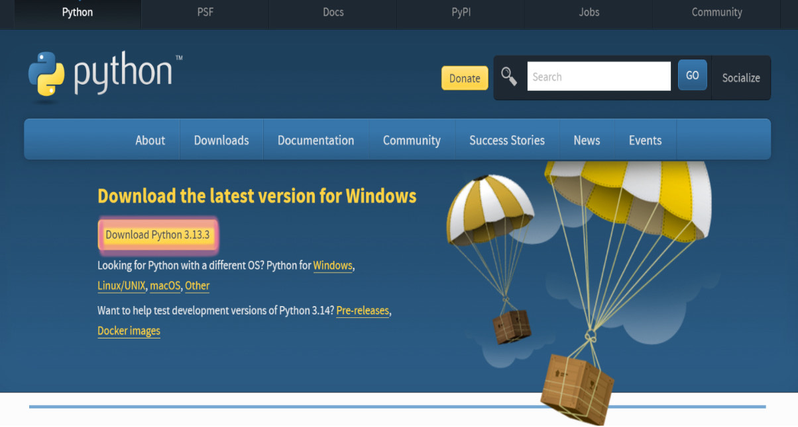
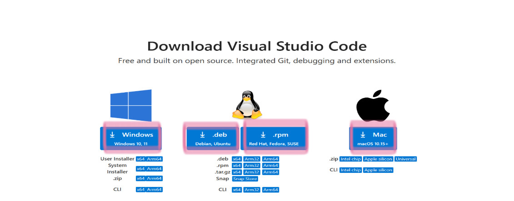
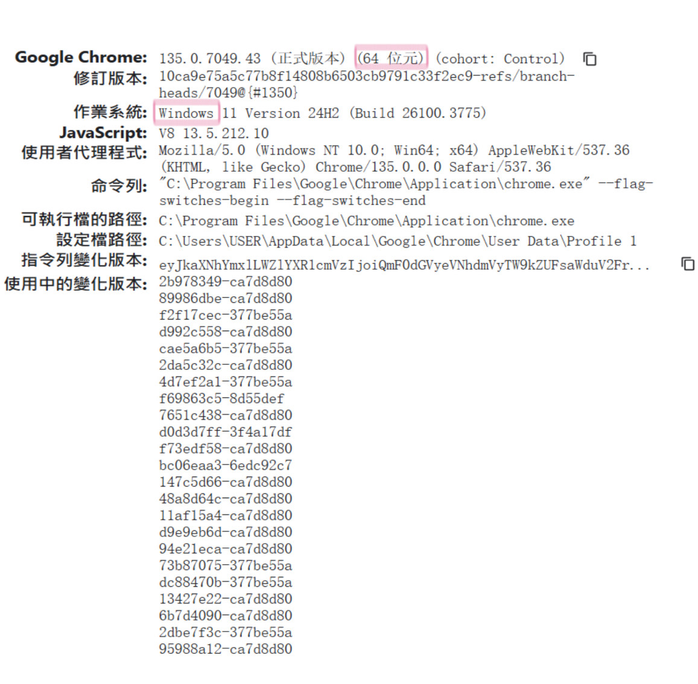
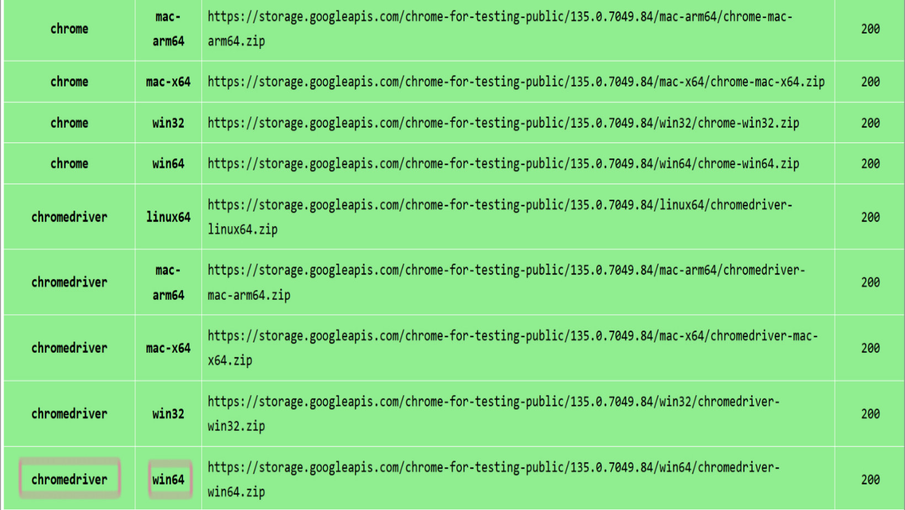

# _Python 爬蟲_

### 如何從亞洲大學資工系網站抓取教授個人資料

- [爬蟲教學](#爬蟲教學)
  - [網頁爬蟲介紹](#網頁爬蟲介紹)
  - [實例教學](#實例教學)
    - [第一步:下載](#第一步:下載)
      - [Python](#python)
      - [VS Code](#VSCode)
        - [VS Code安裝套件](#VSCode安裝套件)
      - [ChromeDriver](#ChromeDriver)
    - [第二步:安裝](#第二步:安裝)
      - [ pip](#pip)
      - [BeautifulSoup4](#BeautifulSoup4)
      - [Selenium](#Selenium)
    - [第三步:程式碼說明與配置](#第二步:程式碼說明與配置)
      - [引入模組](#引入模組)
      - [設定 ChromeDriver](#設定ChromeDriver)
      - [開啟目標網站與等待頁面載入](#開啟目標網站與等待頁面載入)
      - [模擬滾動頁面](#模擬滾動頁面)
      - [擷取 HTML 與關閉瀏覽器](#擷取HTML與關閉瀏覽器)
      - [儲存 HTML 以便除錯](#儲存HTML以便除錯)
      - [使用 BeautifulSoup 解析 HTML 並分區抓取內容](#使用BeautifulSoup解析HTML並分區抓取內容)
      - [儲存結果到文字檔](#儲存結果到文字檔)
  - [輸出結果](#輸出結果)
  - [可能遇到的問題與解決辦法](#可能遇到的問題與解決辦法)

## 網頁爬蟲介紹

網頁爬蟲是一種自動化工具，主要用於系統化抓取網站上的資訊。它從起始 URL 出發，下載並解析 HTML 文件，提取出網頁中的鏈接、文本、圖像等資訊，再透過循環抓取不斷擴大數據收集範圍。常用技術包括 HTTP 請求庫、HTML 解析庫、以及動態內容處理工具。此外，分散式爬蟲框架如 Scrapy 能夠有效處理大規模數據抓取。

在實際應用中，網頁爬蟲廣泛用於搜尋引擎資料索引、數據挖掘、新聞聚合及學術研究。然而，使用爬蟲時須遵守網站的 robots.txt 規範、避免過度訪問導致服務中斷，以及注意版權和隱私問題。隨著動態網頁和反爬技術的普及，爬蟲面臨更多技術和法律上的挑戰，但同時也在雲計算及分佈式系統的支持下不斷進步和發展。

## 實例教學

### 第一步:下載
### Python

[Python下載](https://www.python.org/downloads/).

點擊上面Python下載進入網址，點擊Download Python 3.13.3



### VS Code

[VS Code下載](https://code.visualstudio.com/download)

點擊上面VS Code下載進入網址，點擊自己電腦的平台



### ChromeDriver

目前安裝的Chrome版本查詢

在Chrome的網址列輸入 chrome://version，然後按 Enter



[ChromeDriver下載](https://googlechromelabs.github.io/chrome-for-testing/#stable)

依據目前安裝的Chrome版本，點擊上面ChromeDriver下載進入網址，下載相對應版本的ChromeDriver



下載後解壓縮，會得到一個 chromedriver.exe 檔案

將 chromedriver.exe 放到一個你方便管理的資料夾中

### 第二步:安裝
### pip

在命令提示字元中執行以下指令（請確保你是在系統的命令提示字元中，而非 Python 互動模式）

這個指令安裝 pip

```bash
C:\Users\USER\AppData\Local\Programs\Python\Python313\python.exe -m ensurepip
```

驗證安裝

完成上述步驟之後，在命令提示字元執行：

```bash
C:\Users\USER\AppData\Local\Programs\Python\Python313\python.exe -m pip --version
```

如果成功顯示 pip 版本號，代表 pip 安裝成功


### BeautifulSoup4

透過pip安裝 BeautifulSoup4

```bash
pip install beautifulsoup4
```

!

### Selenium

使用pip安裝Selenium模組

```bash
C:\Users\USER\AppData\Local\Programs\Python\Python313\python.exe -m pip install selenium
```

!
